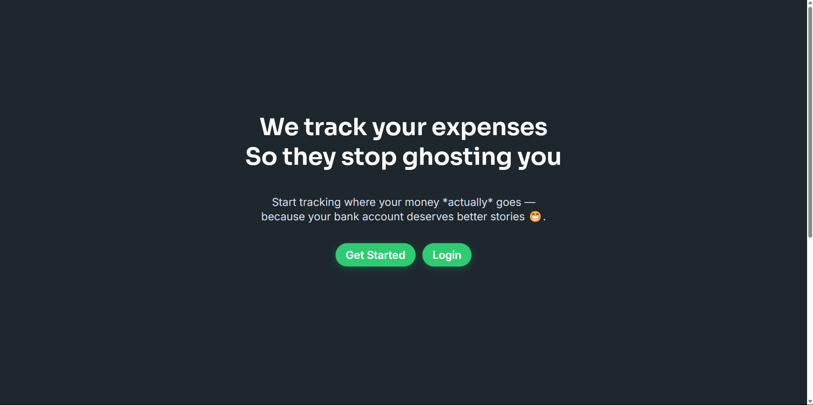
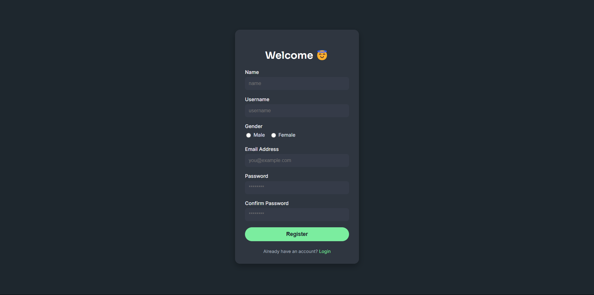
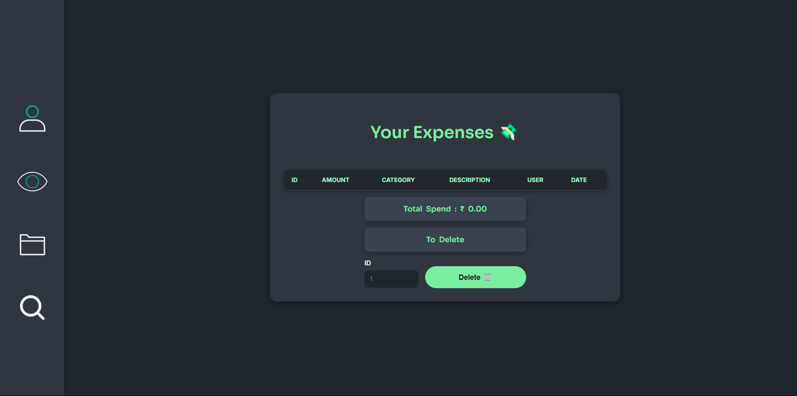
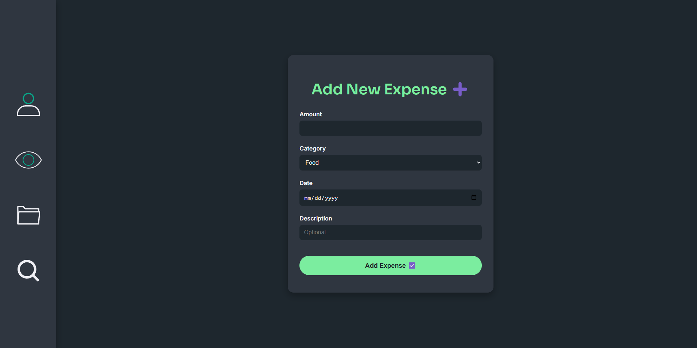
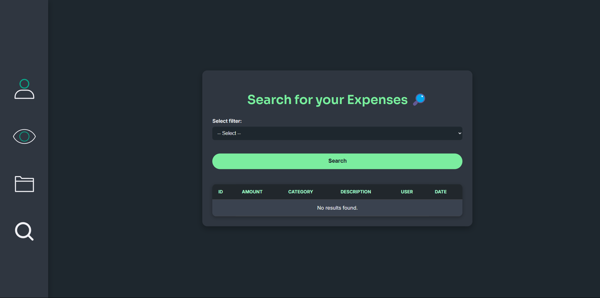

# ExpenseTracker 🧾

A simple Web app to manage your daily expenses 💸.

---

## 🚀 Features
- User Registration & Login 🔐
- Add, Delete, and View Expenses 🧾
- Filter by Category, Date, or Amount 📊
- Animated UI using [Lordicon](https://lordicon.com) ✨

---

## 🛠️ Tech Stack
- **Frontend**: HTML, CSS (custom + responsive), JavaScript
- **Backend**: Python (Flask)
- **Database**: MySQL (Aiven-compatible)

---

## 📷 Screenshots
### 🏠 Homepage


### 📝 Register


### 🔐 Login


### 📊 Dashboard


### ➕ Add Expense


### 🔎 Search / Filter


---

## ⚙️ Getting Started

### Prerequisites
- Python 3.8+
- MySQL or Aiven-hosted MySQL

### Installation
```bash
# Clone the repo
https://github.com/Aryanc06/ExpenseTracker.git
cd ExpenseTracker

# Create virtual environment
python -m venv venv
source venv/bin/activate  # On Windows: venv\Scripts\activate

# Install dependencies
pip install -r requirements.txt

# Set up .env for DB credentials (or config manually in Pythonmain.py)
```

### Run the App
```bash
flask run
```
Visit `http://localhost:5000`

---

## 🗃️ Database Setup
Make sure your MySQL database is running and update your connection string in `Pythonmain.py` accordingly.

---

## 🙌 Contributions
Pull requests are welcome! Feel free to fork this repo, improve this web .

---

## 📄 License
MIT License

---

Made by [@Aryanc06](https://github.com/Aryanc06)

